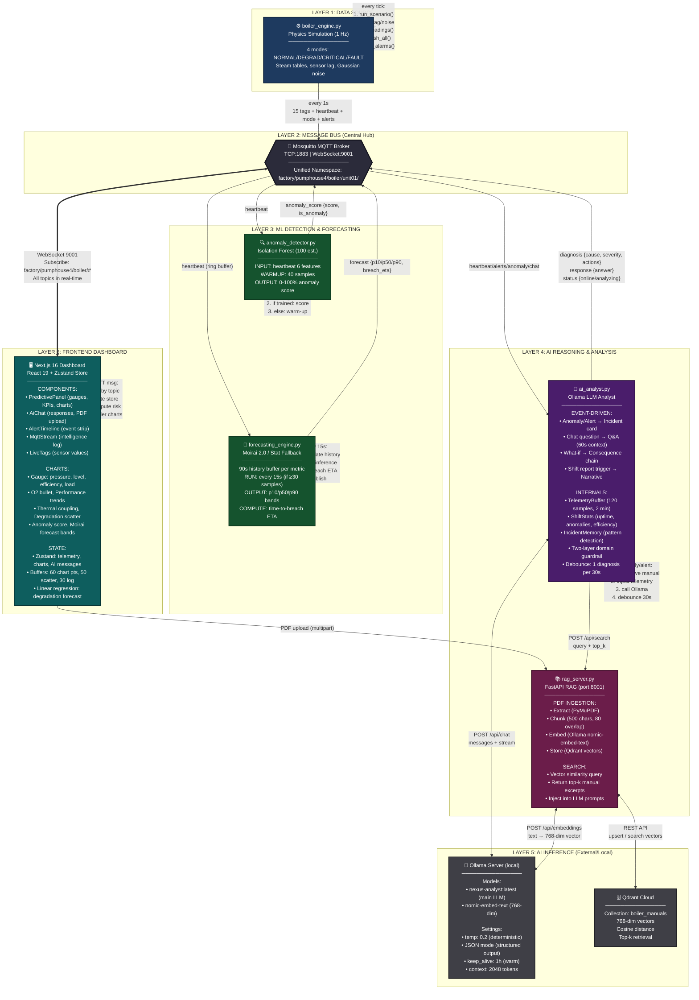
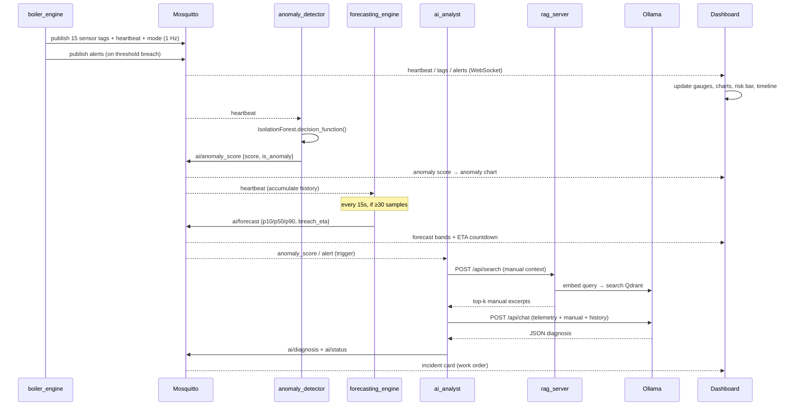

# NEXUS OS — Boiler Intelligence Platform

**A real-time industrial boiler monitoring, prediction & diagnosis platform.**

NEXUS OS simulates a live industrial fire-tube boiler and layers four kinds of
intelligence on top of its sensor stream: **physics** (a thermodynamic data
engine), **statistical ML** (anomaly detection), **probabilistic forecasting**
(time-series model), and **language reasoning** (a local LLM analyst with
document-grounded RAG). Every layer is fully decoupled and communicates over a
single MQTT message bus — the physics engine *publishes*, the ML engines *score
and forecast*, the AI *explains*, and the dashboard *renders*.

> **Note on this document vs. `README.md`:** `README.md` describes an earlier
> iteration (Groq cloud LLM + single-file `index.html`). This document reflects
> the **current code**: a **local Ollama LLM**, a **RAG document server**, a
> **Moirai forecasting engine**, and a **Next.js 16 dashboard**.

---

## 1. Table of Contents

1. [What the Project Does](#2-what-the-project-does)
2. [System Architecture](#3-system-architecture)
3. [Data Flow Diagram](#4-data-flow-diagram)
4. [Work / Process Diagram](#5-work--process-diagram-per-service)
5. [Component Deep-Dive](#6-component-deep-dive)
6. [MQTT Topic Map](#7-mqtt-topic-map-the-contract)
7. [Current Functionalities](#8-current-functionalities)
8. [How to Run It](#9-how-to-run-it)
9. [Tech Stack (Detailed)](#10-tech-stack-detailed)
10. [Feature Catalogue (Detailed)](#11-feature-catalogue-detailed)

---

## 2. What the Project Does

NEXUS OS is a **demo / proof-of-concept digital-twin dashboard** for a single
industrial boiler (`BOILER-01` in `pumphouse4`). It answers four operator
questions in real time:

| Question | Answered by |
|---|---|
| *"What is the boiler doing right now?"* | Physics engine → live telemetry + gauges/charts |
| *"Is something abnormal?"* | Isolation Forest anomaly detector |
| *"What is about to happen?"* | Moirai probabilistic forecaster (time-to-breach) |
| *"Why, and what do I do about it?"* | Ollama LLM analyst (incident cards, chat, what-if, shift report) — grounded in the boiler manual via RAG |

The whole system runs **locally** — the only optional external dependency is a
**Qdrant Cloud** vector database for the RAG knowledge base.

---

## 3. Complete System Architecture (Unified & Detailed)

A single comprehensive view of the entire NEXUS OS platform lifecycle:



**Key Architectural Principles**

- **Event-driven & decoupled** — every service only knows MQTT topics, never
  other services' addresses. Kill/restart any service independently.
- **LLM is an *explainer*, never a *detector*** — the math (Isolation Forest,
  Moirai) runs first; the LLM only converts numbers into language *after*.
- **Unified Namespace (UNS)** — `factory/pumphouse4/boiler/unit01/...` mirrors
  real IIoT plant data structure.
- **Local-first** — physics, ML, forecasting, LLM, and embeddings all run
  locally; only Qdrant vector DB is cloud-hosted.
- **Two-channel communication** — MQTT for real-time pub/sub; HTTP for
  knowledge/reasoning (RAG, LLM generation).

---

## 4. Data Flow Sequence (Timing View)

The unified diagram above shows the *structure*. This sequence diagram shows the *timing* — what happens in a single heartbeat:



---

## 5. Service Process Details

Each service's internal loop is shown in the unified diagram above (see the dotted callout boxes labeled "every tick", "on heartbeat", etc.). Refer to **Section 6 (Component Deep-Dive)** for detailed pseudocode of each service's logic.

---

## 6. Component Deep-Dive

### 6.1 `engine/boiler_engine.py` — Physics Simulation Engine
The "ground truth" data source. A state machine modelling a fire-tube boiler
with **real thermodynamic relationships**, not random numbers:

- **Steam temperature** derived from pressure via a simplified Antoine/steam-table
  approximation (`T_sat ≈ 42.677 × P^0.2876 × 10`) + 5 °C superheat.
- **Efficiency** = `90 − stack_loss − excess_air_loss − scaling_loss`
  (functions of flue-gas temp, O₂%, and tube degradation).
- **Sensor lag** via exponential-smoothing buffers (pressure 5-tap, temp 8-tap,
  flue-gas 12-tap) to mimic sluggish thermocouple/transmitter response.
- **Gaussian noise** applied per-sensor with realistic sigma percentages.
- **Four operating modes**, switchable live from the terminal:

  | Mode | Key | Behaviour |
  |---|---|---|
  | IDEAL | `i` | Clean reference run: no faults, no degradation, neutral environment, stable load |
  | NORMAL | `n` / `s` | Controlled operation, all setpoints met |
  | DEGRADING | `d` | Tube scaling — fuel↑, flue-gas temp↑, efficiency↓ (linear ramp) |
  | CRITICAL | `c` | Feedwater struggles, drum level drops toward dry-fire |
  | FAULT | `f` | Flame failure / ESD — combustion stops, O₂ → 20.9% |
  | RESET | `r` | Back to fresh normal state |

- Publishes 15 individual tag topics + a full `heartbeat` snapshot + `mode`
  every second, and structured `alerts` on threshold breaches.

### 6.2 `engine/anomaly_detector.py` — ML Anomaly Detector
- **scikit-learn `IsolationForest`** (100 estimators, 5% contamination, seed 42).
- Subscribes to `heartbeat`; extracts 6 features: `steam_pressure`,
  `steam_temperature`, `drum_level`, `fuel_flow`, `flue_gas_temp`, `efficiency`.
- **Warm-up**: collects 40 samples, then trains itself once on the live stream.
- After training, scores every reading. Raw decision score is mapped to a
  0–100% UI value: `anomaly_pct = clamp(0,100, (1 − score) × 50)`.
- Publishes `{score, is_anomaly, timestamp}` to `.../ai/anomaly_score`.

### 6.3 `engine/forecasting_engine.py` — Probabilistic Forecaster
- Targets **Salesforce Moirai 2.0 (R-Small)** via the `uni2ts` library; falls
  back to a **HuggingFace pipeline**, then to a pure-Python **statistical
  Monte-Carlo simulation** (Holt's double exponential smoothing + 100 sample
  paths) if the model isn't installed. The active backend is reported in every
  payload (`uni2ts` / `hf_pipeline` / `simulation`).
- Keeps a 90-second ring buffer per metric (`tube_health`, `efficiency`,
  `steam_pressure`); runs inference **every 15 s** once ≥30 samples exist.
- Produces **p10 / p50 / p90** quantile bands over a 60-second horizon and
  computes a **time-to-breach ETA** for tube health crossing the 70% threshold.
- Publishes to `.../ai/forecast`.

### 6.4 `engine/ai_analyst.py` — LLM Analyst Service
The reasoning layer. Connects to a **local Ollama server** (model
`nexus-analyst:latest`, `temperature 0.2`, JSON mode for structured outputs,
`keep_alive 1h` to keep the model warm). Internal building blocks:

- **`TelemetryBuffer`** — `deque(maxlen=120)` ring buffer (~2 min of 1 Hz data);
  `get_context(n)` renders compact timestamped trend lines for prompt injection.
- **`ShiftStats`** — accumulates uptime %, anomaly count, alerts by severity,
  efficiency min/max/start/end, and modes seen since service start.
- **`IncidentMemory`** — session log of alert *episodes* (1 Hz alarms
  de-duplicated into 60 s episodes) + past diagnoses, enabling pattern
  correlation ("third flue-gas spike this session").
- **Two-layer domain guardrail** — a **blocklist** (food, sports, jailbreaks,
  off-domain tech) rejects adversarial questions first; an **allowlist** of
  boiler/plant terms must then match before the question reaches the LLM.
- **RAG integration** — `rag_retrieve()` calls the RAG server's `/api/search`
  and injects manual excerpts into diagnosis and chat prompts.

It reacts to: `anomaly_score`, `alerts`, and chat `question` messages, and emits
`ai/diagnosis`, `ai/response`, and `ai/status`.

### 6.5 `engine/rag_server.py` — RAG Knowledge Server
A standalone **FastAPI** service (port 8001):

- **`POST /api/upload-pdf`** — extracts text with **PyMuPDF**, chunks it
  (500 chars, 80 overlap), embeds each chunk with **Ollama `nomic-embed-text`**
  (768-dim), and upserts to a **Qdrant Cloud** collection (`boiler_manuals`,
  cosine distance).
- **`POST /api/search`** — embeds the query, returns top-k nearest chunks.
- **`GET /api/docs`** — lists ingested filenames; **`GET /health`** — liveness.

### 6.6 `frontend/` — Next.js 16 Dashboard
- **`useMqtt` hook** opens a WebSocket MQTT connection (`ws://localhost:9001`),
  subscribes to `factory/pumphouse4/boiler/#`, routes each topic into a
  **Zustand store** (`lib/store.ts`).
- The store maintains bounded buffers for charts (60 pts), scatter (50), stream
  log (30), alerts (20), chat (25), and health history (45), and computes the
  **client-side linear-regression degradation forecast** (overridden by Moirai's
  ETA when available).
- **`PredictivePanel`** composes gauges, O₂ bullet, derived KPIs, performance/
  thermal/scatter/anomaly charts, and the two Moirai forecast charts.
- **`AiChat`** handles chat input, quick-prompt chips, shift-report trigger,
  what-if routing, and **PDF upload** (proxied through the Next.js
  `/api/upload-pdf` route to the RAG server).
- **`utils.ts`** computes risk score, combustion advice, derived metrics
  (boiler load, pressure margin, steam/fuel ratio), and ETA formatting.

---

## 7. MQTT Topic Map (the contract)

Base: `factory/pumphouse4/boiler/unit01`

| Topic suffix | Publisher | Consumer(s) | Payload |
|---|---|---|---|
| `steam/*`, `water/*`, `combustion/*`, `safety/*`, `kpi/*` | boiler_engine | dashboard | `{value, timestamp, unit}` per tag |
| `system/heartbeat` | boiler_engine | dashboard, anomaly, forecasting, ai | full snapshot (all tags + mode + degradation) |
| `system/mode` | boiler_engine | dashboard | mode string |
| `alerts` | boiler_engine | dashboard, ai | `{severity, message, tag, value, threshold}` |
| `ai/anomaly_score` | anomaly_detector | dashboard, ai | `{score, is_anomaly, timestamp}` |
| `ai/forecast` | forecasting_engine | dashboard | `{metrics{p10,p50,p90}, projected_breach_eta, backend}` |
| `ai/question` | dashboard | ai | `{question}` / `{type: shift_report\|what_if}` |
| `ai/response` | ai_analyst | dashboard | chat answer / shift report / what-if JSON |
| `ai/diagnosis` | ai_analyst | dashboard | incident card JSON |
| `ai/status` | ai_analyst | dashboard | `{status: online\|analyzing}` |

---

## 8. Current Functionalities

**Monitoring & Visualisation**
- Live 1 Hz telemetry of 15 sensor tags over MQTT WebSocket.
- Four doughnut gauges (pressure, drum level, efficiency, boiler load), O₂
  bullet bar, and derived KPI mini-cards (pressure margin, steam/fuel ratio).
- Multi-line performance trends, thermal-coupling divergence, degradation
  scatter, and anomaly-score charts (all Chart.js, 60-point buffers).
- Live MQTT intelligence stream log + horizontal alert/event timeline.
- Light/dark theme with persistence.

**Detection & Prediction**
- Isolation Forest anomaly scoring on the live stream (0–100%).
- Composite client-side **failure-risk score** with colour-coded risk bar.
- **Degradation forecaster** — linear regression time-to-breach countdown,
  upgraded to **Moirai probabilistic forecast** with p10/p90 bands when running.
- **Combustion tuning advisor** — live O₂-based efficiency recommendation.

**AI Reasoning (Ollama LLM)**
- **Incident diagnosis cards** — auto-generated on anomaly/critical-alert
  triggers; JSON with probable cause, severity, explanation, recommended action,
  confidence, deviated sensors, and a recurring-**pattern note**. Debounced to
  one per 30 s.
- **"Ask the Plant" chat** — free-form Q&A with 60 s telemetry context, 3-turn
  memory, and a two-layer off-domain guardrail.
- **What-If simulator** — physical consequence-chain walkthrough from current
  state, with risk level and operator actions.
- **End-of-shift report** — narrative + hard stats (uptime, anomalies, alerts,
  efficiency delta) from `ShiftStats`.
- **Manual-grounded RAG** — upload boiler manual PDFs; relevant excerpts are
  retrieved and cited inside diagnoses and chat answers.

---

## 9. How to Run It

**Prerequisites:** Mosquitto with WebSocket listener on 9001, Python deps from
`requirements.txt`, Node deps in `frontend/`, a running **Ollama** server with
`nexus-analyst` and `nomic-embed-text` models, and Qdrant credentials (for RAG).

```bash
# 0. Mosquitto WebSocket listener (see conf.d for the snippet)
#    listener 9001 / protocol websockets / allow_anonymous true

# 1. Python services (separate terminals)
pip install -r requirements.txt
python engine/boiler_engine.py        # physics (press i/d/c/f/s/r to drive scenarios)
python engine/anomaly_detector.py     # Isolation Forest
python engine/forecasting_engine.py   # Moirai / statistical forecaster
export OLLAMA_BASE_URL=http://<host>:11434
export OLLAMA_MODEL=nexus-analyst:latest
python engine/ai_analyst.py           # LLM analyst

# 2. RAG server (optional, for manual grounding)
uvicorn engine.rag_server:app --host 0.0.0.0 --port 8001

# 3. Dashboard
cd frontend && npm install && npm run dev   # http://localhost:3000
```

> ⚠️ **Security note:** `engine/rag_server.py` currently contains a hard-coded
> Qdrant URL and API key as defaults. These should be moved to environment
> variables / secrets and the embedded key rotated before any non-demo use.

---

## 10. Tech Stack (Hierarchical)

```
NEXUS OS Platform
│
├─ 🔌 MESSAGING & TRANSPORT LAYER
│  ├─ Mosquitto MQTT Broker
│  │  ├─ TCP 1883 (service-to-service)
│  │  └─ WebSocket 9001 (browser connectivity)
│  ├─ MQTT QoS 1/2 + JSON payloads
│  └─ Unified Namespace (factory/pumphouse4/boiler/unit01/...)
│
├─ 🐍 BACKEND SERVICES (Python 3)
│  │
│  ├─ ⚙️ Physics Engine (boiler_engine.py)
│  │  ├─ NumPy (thermodynamic math, sensor lag)
│  │  ├─ paho-mqtt 1.6.1 (MQTT publish)
│  │  └─ threading (keyboard input handler)
│  │
│  ├─ 🔍 ML Anomaly Detector (anomaly_detector.py)
│  │  ├─ paho-mqtt 1.6.1 (subscribe to heartbeat)
│  │  ├─ scikit-learn 1.4 (IsolationForest)
│  │  └─ numpy (feature extraction, scoring)
│  │
│  ├─ 🔮 Forecasting Engine (forecasting_engine.py)
│  │  ├─ paho-mqtt 1.6.1 (subscribe to heartbeat)
│  │  ├─ Salesforce Moirai 2.0 (primary: uni2ts library)
│  │  │  ├─ PyTorch (tensor inference)
│  │  │  └─ Transformers (model loading)
│  │  ├─ HuggingFace transformers (fallback: pipeline)
│  │  └─ NumPy (statistical fallback: Holt's + Monte-Carlo)
│  │
│  ├─ 🧠 AI Analyst Service (ai_analyst.py)
│  │  ├─ paho-mqtt 1.6.1 (subscribe: heartbeat/alerts/anomaly/chat)
│  │  ├─ requests (HTTP to Ollama & RAG server)
│  │  ├─ collections (deque for telemetry buffer, chat history, incident memory)
│  │  ├─ threading.Lock (thread-safe telemetry/stats access)
│  │  └─ json (JSON mode responses from LLM)
│  │
│  └─ 📚 RAG Server (rag_server.py)
│     ├─ FastAPI (REST API server)
│     ├─ Uvicorn (ASGI server, port 8001)
│     ├─ PyMuPDF (fitz) (PDF text extraction)
│     ├─ qdrant-client (vector DB client)
│     ├─ Pydantic (request/response validation)
│     ├─ requests (HTTP to Ollama embeddings API)
│     └─ FastAPI CORSMiddleware (cross-origin requests)
│
├─ 🧠 AI INFERENCE LAYER
│  ├─ Ollama Server (local LLM runtime)
│  │  ├─ nexus-analyst:latest (main LLM model)
│  │  └─ nomic-embed-text (768-dim embedding model)
│  └─ Qdrant Cloud (vector database)
│     └─ boiler_manuals collection (PDF chunks + metadata)
│
├─ 🖥️ FRONTEND (Next.js 16 / React 19)
│  │
│  ├─ Framework & Runtime
│  │  ├─ Next.js 16.2 (App Router, API routes)
│  │  ├─ React 19.2 (component library)
│  │  └─ TypeScript 5 (type safety, interfaces)
│  │
│  ├─ State Management
│  │  └─ Zustand 5 (global store: telemetry, charts, AI messages)
│  │
│  ├─ Real-Time Communication
│  │  └─ MQTT.js 5 (browser WebSocket MQTT client)
│  │
│  ├─ Visualization
│  │  ├─ Chart.js 4 (chart rendering engine)
│  │  └─ react-chartjs-2 (React wrapper)
│  │
│  ├─ Styling
│  │  └─ Tailwind CSS 4 (utility-first styling)
│  │
│  └─ Components
│     ├─ Dashboard.tsx (layout)
│     ├─ PredictivePanel.tsx (gauges, KPIs, charts)
│     ├─ AiChat.tsx (LLM responses, PDF upload, quick prompts)
│     ├─ AlertTimeline.tsx (alert event strip)
│     ├─ MqttStream.tsx (intelligence log)
│     ├─ LiveTags.tsx (current sensor values)
│     └─ charts/
│        ├─ GaugeChart.tsx (pressure, level, efficiency, load)
│        ├─ O2Chart.tsx (combustion air ratio)
│        ├─ PerformanceTrends.tsx (efficiency, tube health, heat rate)
│        ├─ ThermalCoupling.tsx (steam temp vs flue gas)
│        ├─ DegradationScatter.tsx (fuel vs steam output)
│        ├─ AnomalyChart.tsx (anomaly score timeline)
│        └─ ForecastChart.tsx (Moirai p10/p50/p90 bands)
│
├─ 🔧 INFRASTRUCTURE & TOOLING
│  ├─ Mosquitto Configuration
│  │  └─ conf.d/websockets.conf (listener 9001, protocol websockets)
│  ├─ Linting & Code Quality
│  │  ├─ ESLint 9
│  │  └─ eslint-config-next (Next.js-aware rules)
│  ├─ Version Control
│  │  └─ Git
│  └─ Package Management
│     ├─ pip (Python dependencies)
│     └─ npm (Node.js dependencies)
│
└─ 🌐 DEPLOYMENT & RUNTIME
   ├─ Python Runtime
   │  └─ Python 3.x + venv
   ├─ Node.js Runtime
   │  └─ Node 18+ (Next.js)
   ├─ Network
   │  ├─ localhost:1883 (MQTT internal)
   │  ├─ localhost:9001 (MQTT WebSocket)
   │  ├─ localhost:3000 (Next.js dev server)
   │  ├─ localhost:8001 (RAG FastAPI)
   │  └─ http://192.168.0.105:11434 (Ollama, configurable)
   └─ External Services
      └─ Qdrant Cloud (SaaS, env-configured)
```

### Dependency flow diagram

```
┌─────────────────────────────────────────────────────────────┐
│ APPLICATION LOGIC                                           │
├─────────────────────────────────────────────────────────────┤
│  Physics   │  Anomaly   │  Forecasting  │  AI Analyst  │    │
│  Engine    │  Detector  │  Engine       │  + RAG       │    │
└──────┬─────┴────┬───────┴────────┬──────┴──────┬────────┘    │
       │          │                │             │             │
       └─ MQTT ──>│                │         HTTP/API          │
       paho-mqtt  └────────────────┴────────────────┐          │
│                                                   │          │
├─────────────────────────────────────────────────────────────┤
│ MESSAGE BUS & KNOWLEDGE                                     │
├─────────────────────────────────────────────────────────────┤
│  Mosquitto MQTT        │  Ollama + Qdrant                   │
│  (TCP 1883)            │  (LLM + vector DB)                 │
│  (WebSocket 9001)      │  (embeddings + search)             │
└──────┬────────┬────────┴──────────┬──────────────┘          │
       │        │                   │                         │
       │        └─ WebSocket ──────>│                         │
       │                     MQTT.js │                         │
│      │                             │                        │
├──────┴─────────────────────────────┴────────────────────────┤
│ USER INTERFACE                                              │
├──────────────────────────────────────────────────────────────┤
│  Next.js + React + Chart.js + Tailwind + Zustand           │
│  (Browser, port 3000)                                       │
└──────────────────────────────────────────────────────────────┘
```

---

## 11. Feature Catalogue (Detailed)

### A. Physics-Based Simulation
Realistic thermodynamics (steam-table-derived temperatures, efficiency loss
model), sensor lag buffers, per-sensor Gaussian noise, four live-switchable
operating modes, automatic scenario ramps (degradation grows linearly over
30 ticks), and rule-based alarm publishing.

### B. ML Anomaly Detection
Self-training Isolation Forest on the live stream (40-sample warm-up), 6-feature
vector, inverted/scaled 0–100% anomaly score published every reading.

### C. Probabilistic Forecasting
Moirai 2.0 (with HuggingFace and pure-statistical fallbacks), p10/p50/p90 bands
over a 60 s horizon for tube health / efficiency / steam pressure, and a
time-to-breach ETA for the 70% tube-health inspection threshold. Backend used is
surfaced as a badge in the UI.

### D. Predictive Intelligence (client-side)
- **Composite failure-risk score** = `degradation×100` + threshold-breach
  penalties (drum level, pressure, tube health, flame), rendered as a pulsing
  colour-coded bar.
- **Degradation rate forecaster** — least-squares regression over ~45 tube-health
  samples → live countdown + degradation rate (%/min); Moirai ETA takes
  precedence when present.
- **Combustion tuning advisor** — λ-based excess-air recommendation against the
  2–4% optimal O₂ band, with CO-risk and flame-failure handling.
- **Derived KPIs** — boiler load, pressure margin to safety-valve lift,
  steam/fuel ratio.

### E. AI Analyst (Ollama LLM)
- **Incident Diagnosis Cards** — JSON `{probable_cause, severity, explanation,
  recommended_action, confidence, pattern_note, deviated_sensors[]}`, triggered
  by anomalies / critical alerts, debounced 30 s, rendered as work orders.
- **"Ask the Plant" Chat** — 60 s telemetry context + 3-turn memory + incident
  history; formatting rules enforced; typewriter rendering on the UI.
- **Two-layer Domain Guardrail** — blocklist (adversarial/off-domain) then
  allowlist (boiler/plant vocabulary).
- **What-If Simulator** — step-by-step physical consequence chain from current
  state, citing real protection thresholds; rendered as a risk-badged card.
- **Multi-Turn Incident Memory** — episode de-duplication + recurring-pattern
  detection surfaced via `pattern_note`.
- **End-of-Shift Report** — LLM narrative on top of locally-computed hard stats,
  rendered as a 4-stat card.

### F. RAG Manual Grounding
PDF upload from the dashboard → FastAPI ingestion → PyMuPDF extraction →
chunking → Ollama embeddings → Qdrant → retrieval injected into diagnosis and
chat prompts so the AI can cite the boiler's own manuals.

### G. Real-Time Dashboard UX
WebSocket MQTT streaming into a Zustand store, six+ live Chart.js visualisations,
intelligence stream log, alert timeline, animated AI chat panel with quick-prompt
chips, and persistent light/dark theming.
```
